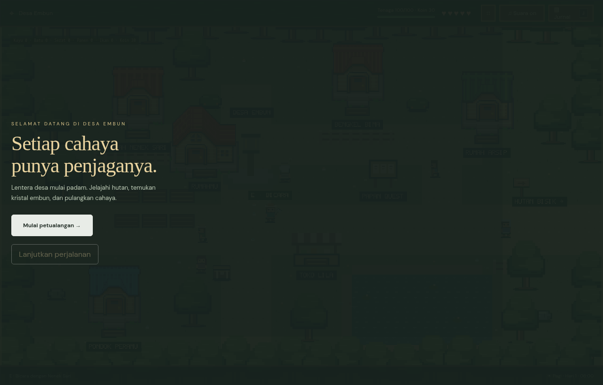
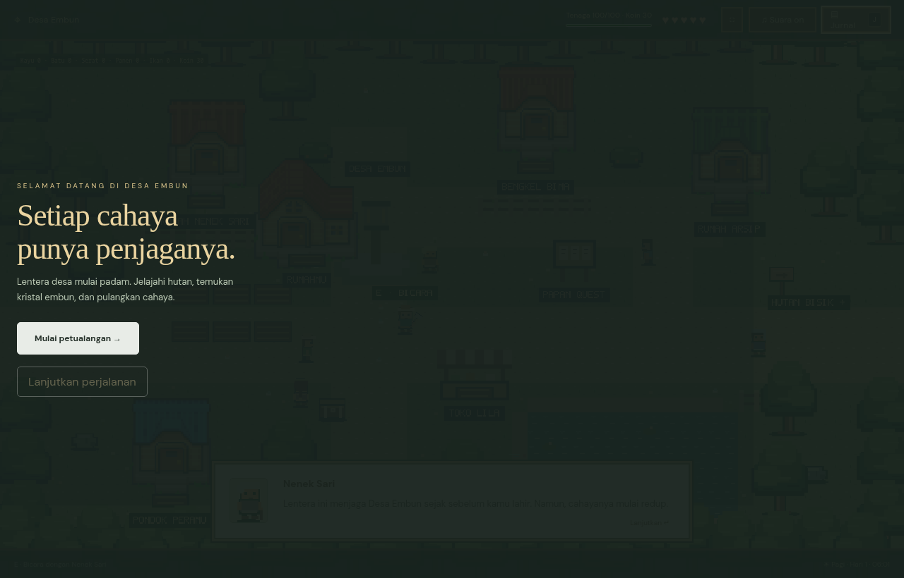
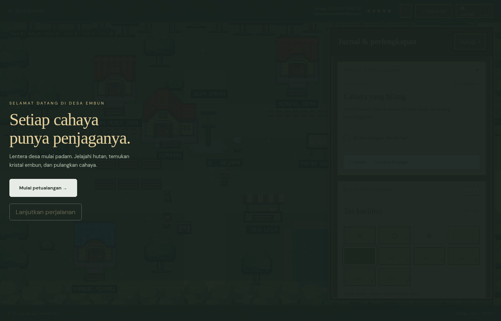
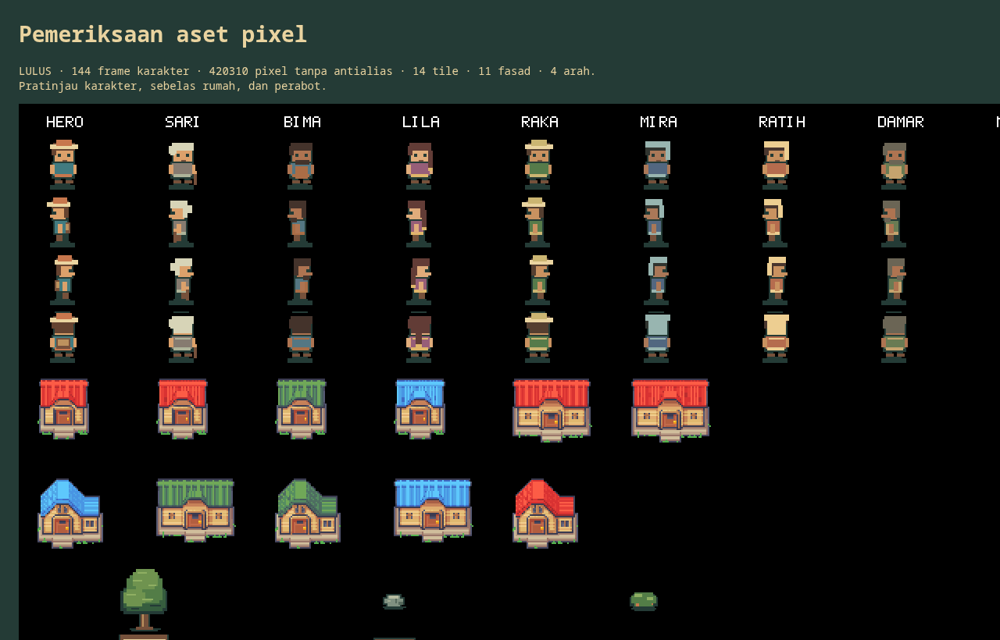

# 🏮 Penjaga Lentera (The Lantern Keeper)

[](LICENSE)
[](https://www.typescriptlang.org/)
[](https://phaser.io/)
[](https://vitejs.dev/)
[](https://nodejs.org/)
[](src/state.test.ts)

> **Penjaga Lentera** (*The Lantern Keeper*) is a cozy, browser-based 2D pixel-art action-adventure and life-simulation RPG set in the tranquil valley of **Desa Embun** (Dew Village). Built with **Phaser 3**, **TypeScript**, and **Vite**, the game showcases a complete, responsive gameplay loop running natively in modern web browsers: world exploration, interactive NPC dialogue, real-time combat, agriculture, animal husbandry, fishing, a village economy, dynamic day–night cycles, and robust save persistence.

---

## 📖 Table of Contents

- [Gameplay Preview](#-gameplay-preview)
- [Overview & Narrative](#-overview--narrative)
- [Key Features](#-key-features)
  - [1. Expansive World & Seamless Interiors](#1-expansive-world--seamless-interiors)
  - [2. Action-Adventure & Ancient Crystals](#2-action-adventure--ancient-crystals)
  - [3. Deep Life-Sim & Homesteading](#3-deep-life-sim--homesteading)
  - [4. Dynamic 24-Hour World Clock & Lighting](#4-dynamic-24-hour-world-clock--lighting)
  - [5. Handcrafted Pixel-Art Engine](#5-handcrafted-pixel-art-engine)
  - [6. Web Audio Soundscape](#6-web-audio-soundscape)
  - [7. Save System & State Management](#7-save-system--state-management)
- [Technology Stack](#-technology-stack)
- [Getting Started](#-getting-started)
  - [Prerequisites](#prerequisites)
  - [Installation & Local Development](#installation--local-development)
  - [Production Build](#production-build)
- [Controls & Keybindings](#-controls--keybindings)
- [Diagnostic & Visual Test Pages](#-diagnostic--visual-test-pages)
- [Project Architecture](#-project-architecture)
- [Assets & Attribution](#-assets--attribution)
- [Roadmap & Project Status](#-roadmap--project-status)
- [License](#-license)

---

## 📸 Gameplay Preview

| **Exploring Desa Embun (Dew Village)** | **Interactive Dialogue with Nenek Sari** |
| :---: | :---: |
|  |  |

| **Journal, Active Quests & Backpack Inventory** | **Procedural Character Atlas & Building Facades** |
| :---: | :---: |
|  |  |

<details>
<summary><b>🔍 View Welcome Title Screen</b></summary>


</details>

---

## 🌄 Overview & Narrative

Tucked deep within misty mountains lies **Desa Embun** (Dew Village), a peaceful settlement protected for generations by a mystical stone beacon in the heart of **Hutan Bisik** (Whispering Woods). When the ancient lantern's flame dims and strange shadowy beasts begin creeping near the village perimeter, the mantle of the **Lantern Keeper** falls upon you.

As the apprentice keeper, you must balance the peaceful rhythms of rural life—tilling soil, watering crops, tending livestock, fishing, cooking, and trading with villagers—with perilous excursions into the forest to battle monsters, locate three sacred elemental crystals, upgrade your gear, and re-ignite the ancestral beacon to restore harmony to the land.

---

## ✨ Key Features

### 1. Expansive World & Seamless Interiors
- **Desa Embun (Main Village)**: A lively community with cobblestone pathways, rustic cottages, bridges, and lush foliage.
- **Village Town Center & Traditional Market**: Purchase vegetable seeds, sell raw goods, and converse with merchants.
- **Homestead & Kitchen**: Your personal sanctuary featuring a farmland patch, a chicken coop, a cooking hearth, and a shipping deposit bin.
- **Walkable Interior Locations**:
  - **Village Hall**: Community bulletins and village council.
  - **Carpenter's Workshop**: Woodworking, building improvements, and fence materials.
  - **Herbalist Sanctuary (*Nenek Sari*)**: Medicinal roots, curative teas, and potion brewing.
  - **Village Clinic**: Respite and medical recovery for exhausted adventurers.
  - **Archives & Library**: Ancient historical scrolls and village chronicles.
  - **General Store**: Essential supplies and adventuring provisions.
- **Hutan Bisik (Whispering Woods)**: A treacherous, sprawling wilderness filled with wild beasts, hidden treasure chests, and forgotten shrines.

### 2. Action-Adventure & Ancient Crystals
- **Main Questline**: Track down three elemental crystals concealed across the realm, unearth hidden chests, and awaken the ancient lantern.
- **Real-Time Combat**: Directional sword attacks, enemy knockback, damage flashes, invulnerability windows, and responsive monster AI.
- **Village Notice Board**: Accept daily community requests (e.g., gathering fence timber for Raka, harvesting crops, collecting medicinal leaves for Nenek Sari, or clearing hostile forest patrols).
- **Sword Sharpening & Upgrades**: Enhance weapon durability and damage output to tackle tougher woodland foes.

### 3. Deep Life-Sim & Homesteading
- **Farming & Cultivation**:
  - **3 Core Crops**: Turnip (*Lobak* - rapid harvest), Carrot (*Wortel* - balanced value), and Pumpkin (*Labu* - high-yield cash crop).
  - Complete agrarian cycle: Till raw plots with the hoe, sow seeds, water daily with the watering can, observe visual multi-stage growth, and reap with the scythe.
- **Resource Gathering**:
  - Fell trees with the woodcutter's axe to gather timber.
  - Break boulders with the pickaxe to obtain stone and minerals.
  - Clear overgrown grass, brush, and weeds to tidy plots.
- **Fishing System**:
  - Cast a line into village streams, rivers, and ponds.
  - Reel in a variety of fresh river fish (or the occasional piece of river debris).
- **Poultry & Livestock (Chicken Ranching)**:
  - Feed your flock daily and pet each chicken to nurture affection levels.
  - Collect fresh eggs every morning from the nesting boxes.
- **Culinary Cooking**:
  - Prepare wholesome dishes at the home stove to replenish stamina and hit points.
- **Homestead Shipping & Economy**:
  - Deposit produce, fish, eggs, and monster spoils into the daily shipping bin.
  - Receive settlement coins at dawn to fund tool upgrades and seed purchases.

### 4. Dynamic 24-Hour World Clock & Lighting
- Continuous real-time celestial clock with 4 distinct phases:
  - **Dawn / Morning (*Pagi*)**: Soft golden dawn lighting, awakening villagers, and cheerful morning rooster crows.
  - **Midday (*Siang*)**: Bright, clear illumination as villagers carry out their daily routines.
  - **Dusk (*Senja*)**: Warm golden-hour amber tints as villagers return to their homes.
  - **Night (*Malam*)**: Deep indigo darkness, glowing street lanterns, and evening cricket soundscapes.
- Time advances naturally during movement, combat, and chores; sleeping in bed safely fast-forwards the clock to morning, triggers the daily shipping payout, and restores full stamina.

### 5. Handcrafted Pixel-Art Engine
- Custom procedural pixel-art atlas and rendering pipeline generating crisp retro sprites for the protagonist, villagers, tools, weapons, crops, monsters, and items.
- Charming building facades and environmental architecture powered by LimeZu's celebrated *Serene Village* tileset.

### 6. Web Audio Soundscape
- Low-latency procedural sound generation through the native Web Audio API:
  - Footstep cadences, tool strikes, tree-chopping impacts, pickaxe clinks, water splashes, combat swings, and cheerful rooster crows.
- Atmospheric background village soundtrack with responsive volume configuration.

### 7. Save System & State Management
- Schema-validated local storage persistence (`Save` state version 1).
- Automatic migration and data integrity verification for legacy save states.
- Tracks player coordinates, inventory, stamina, tools, farm plot states, chicken affection, quest completions, defeated enemies, and village statistics.

---

## 🛠 Technology Stack

| Layer | Technology | Description |
| :--- | :--- | :--- |
| **Engine** | [Phaser 3.90](https://phaser.io/) | Canvas / WebGL game engine managing scenes, inputs, cameras, and collision physics |
| **Language** | [TypeScript 5.9](https://www.typescriptlang.org/) | Strictly typed codebase ensuring rock-solid state management and type safety |
| **Bundler & Tooling** | [Vite 7.1](https://vitejs.dev/) | High-speed local dev server and optimized production ES-module packaging |
| **Audio** | Web Audio API | Low-latency audio buses, procedural sound effects, and spatial music mixing |
| **Testing** | Node.js Built-in Runner | Native TypeScript test runner executing unit and regression suites (`node --test`) |

---

## 🚀 Getting Started

### Prerequisites

Ensure you have **Node.js** ($\ge 22.18$) and **npm** installed on your machine:
```sh
node -v
npm -v
```

### Installation & Local Development

1. **Clone the Repository:**
   ```sh
   git clone https://github.com/Hzkun001/penjaga-lentera.git
   cd penjaga-lentera
   ```

2. **Install Dependencies:**
   ```sh
   npm install
   ```

3. **Start the Development Server:**
   ```sh
   npm run dev
   ```

4. **Play the Game:**
   Open the local Vite URL displayed in your terminal (typically `http://localhost:5173/`).

### Production Build

To run type checking and generate a minified static distribution:

```sh
# Run unit tests
npm test

# Type-check and compile static bundle
npm run build
```

The compiled game assets will be placed into the `dist/` directory, ready for immediate deployment to GitHub Pages, Vercel, Netlify, or any static web host.

---

## 🎮 Controls & Keybindings

| Key / Input | Category | Action |
| :---: | :--- | :--- |
| <kbd>W</kbd> <kbd>A</kbd> <kbd>S</kbd> <kbd>D</kbd> or <kbd>↑</kbd> <kbd>←</kbd> <kbd>↓</kbd> <kbd>→</kbd> | Movement | Move protagonist in four directions |
| <kbd>Shift</kbd> | Movement | Hold to sprint |
| <kbd>1</kbd> – <kbd>6</kbd> | Hotbar | Select active tool (**1: Axe**, **2: Pickaxe**, **3: Scythe**, **4: Hoe**, **5: Fishing Rod**, **6: Watering Can**) |
| <kbd>F</kbd> | Tool | Use selected tool on the tile ahead |
| <kbd>Space</kbd> | Combat | Perform directional sword strike |
| <kbd>E</kbd> or <kbd>Enter</kbd> | Interaction | Talk to NPCs, advance dialogue, harvest crops, pet chickens, open chests |
| <kbd>H</kbd> | Survival | Drink a healing potion |
| <kbd>I</kbd> | Inventory | Open / close inventory bag |
| <kbd>Esc</kbd> | Menu | Pause game, view statistics, and save progress |
| <kbd>Tab</kbd> / <kbd>Enter</kbd> | UI | Navigate modal dialogues and menus |

---

## 🔍 Diagnostic & Visual Test Pages

The repository includes dedicated standalone diagnostic harnesses to inspect and verify game systems independently of your primary save:

- **`/pixel-art-check.html`**:
  Inspects the procedural character sprite atlas, pixel transparency borders, animation frames, and low-resolution rendering sharpness.
- **`/pixel-game-check.html`**:
  Interactive testbench to verify camera tracking, collision bounds, interior portal transitions, tool action triggers, monster spawning/AI, audio triggers, day-night lighting transitions, and sleep routines.

---

## 📂 Project Architecture

```text
penjaga-lentera/
├── public/
│   ├── assets/
│   │   └── serene-village-16x16.png  # Serene Village external tileset texture
│   └── audio/
│       └── music/
│           └── village.mp3           # Ambient background village soundtrack
├── src/
│   ├── audio.ts                      # Web Audio bus, synthesized SFX, and rooster crows
│   ├── main.ts                       # Core Phaser Scene, inputs, collision maps, NPCs, and combat
│   ├── pixel-art.ts                  # Procedural pixel-art atlas and sprite generator
│   ├── pixel-art-check.ts            # Standalone visual inspector for character atlas
│   ├── pixel-game-check.ts           # Standalone harness for mechanics and camera testing
│   ├── state.ts                      # Game state, save/load persistence, farming, economy & time
│   ├── state.test.ts                 # Unit tests for state, time, economy, and save validation
│   └── style.css                     # Responsive viewport styling and canvas presentation
├── index.html                        # Main game entry point
├── pixel-art-check.html              # Character atlas diagnostic viewer
├── pixel-game-check.html             # Gameplay and systems test harness
├── package.json                      # Project scripts and package dependencies
├── tsconfig.json                     # TypeScript compiler configuration
└── README.md                         # Comprehensive documentation
```

---

## 🎨 Assets & Attribution

- **Building Architecture & Fasad**:
  - Exterior building facades and architectural elements utilize **[Serene Village – revamped – RPG Tileset [16x16]](https://limezu.itch.io/serenevillagerevamped)** created by **LimeZu**.
  - Licensed under **[Creative Commons Attribution 4.0 International (CC BY 4.0)](https://creativecommons.org/licenses/by/4.0/)**.
- **Procedural Sprites & Systems**:
  - Characters, tools, weapons, farming plots, chickens, and monster sprites are procedurally synthesized via `src/pixel-art.ts`.
- **Music & Sound**:
  - Background music located in `public/audio/music/village.mp3`. All sound effects are procedurally generated via Web Audio API oscillators and gain envelopes. Attribution is also credited in the in-game journal.

---

## 🗺️ Roadmap & Project Status

The current release represents **Chapter 1: The Gathering Dawn**, covering the complete core daily game loop, the Whispering Woods expedition, crystal retrieval, and the first lantern ignition.

Planned upcoming enhancements:
- [ ] Branching dialogue trees with villager relationship milestones
- [ ] Touchscreen on-screen virtual joystick and action buttons for mobile browsers
- [ ] Additional crop varieties (Strawberries, Corn, Melons) and orchard fruit trees
- [ ] Expanded underground mine shafts with subterranean monster encounters
- [ ] Gamepad / controller input support

---

## 📄 License

This project is licensed under the **[MIT License](LICENSE)**.

---

<p align="center">
  Crafted with care to bring back the warm nostalgic joy of classic 16-bit rural adventures 🏮<br>
  <i>"May the ancient flame forever light your path through the Whispering Woods."</i>
</p>
